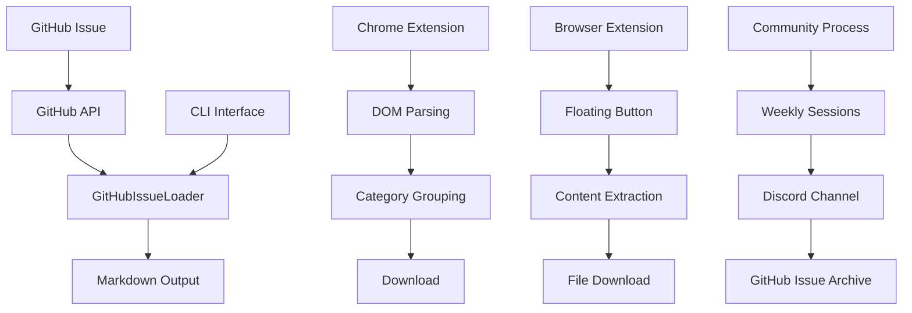
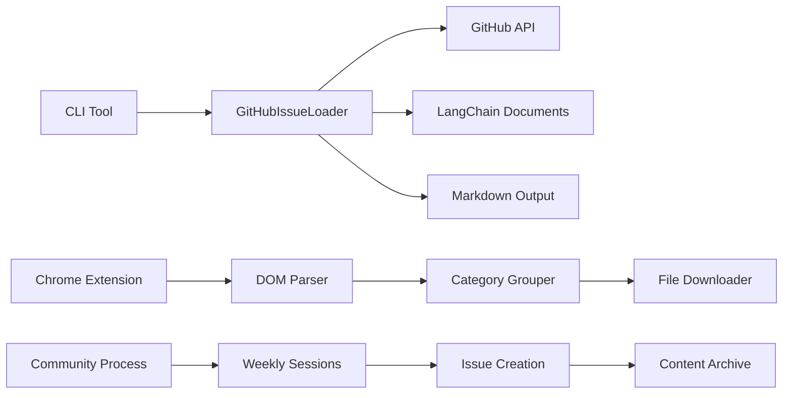
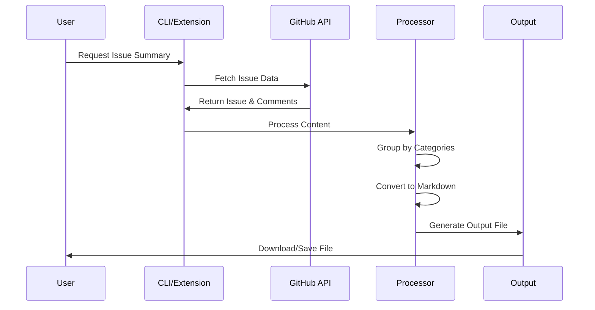

# Weekly Archive Project - CLAUDE.md

## Project Overview

Weekly Archive는 개발 관련 뉴스, 논문, 토론을 GitHub Issue를 통해 관리하고 아카이브하는 종합 시스템입니다. 오픈 채팅방에서 진행되는 주간 세션을 위한 도구와 Chrome 확장 프로그램을 제공합니다.

## Project Structure

```
weekly-archive/
├── README.md                 # 프로젝트 메인 문서
├── summaryREADME.md         # CLI 도구 사용법
├── package.json             # Node.js 프로젝트 설정
├── package-lock.json        # 의존성 락 파일
├── .env.example            # 환경변수 템플릿
├── .gitignore              # Git 무시 파일
├── src/                    # 소스코드 디렉터리
│   ├── index.js            # GitHubIssueLoader 메인 클래스
│   └── cli.js              # 명령줄 인터페이스
├── examples/               # 사용 예제
│   └── simple-example.js   # 기본 사용 예제
├── GithubIssueSummary/     # Chrome 확장 프로그램
│   ├── manifest.json       # 확장 프로그램 매니페스트
│   ├── content.js          # 컨텐츠 스크립트 (메인 추출 로직)
│   ├── popup.html          # 확장 프로그램 팝업 UI
│   ├── popup.js            # 팝업 기능
│   ├── styles.css          # 확장 프로그램 스타일
│   ├── icon48.png          # 확장 프로그램 아이콘 (48x48)
│   └── icon128.png         # 확장 프로그램 아이콘 (128x128)
├── output.md               # 샘플 출력 파일
├── output2.md              # 샘플 출력 파일
└── node_modules/           # Node.js 의존성
```

## Architecture Overview



## Technology Stack

### Backend/CLI Tool
- **Node.js** (ES6 modules)
- **axios** (v1.6.2) - GitHub API HTTP 클라이언트
- **commander** (v11.1.0) - CLI 인수 파싱
- **dotenv** (v16.3.1) - 환경변수 관리
- **@langchain/core** (v0.1.22) - 문서 처리
- **@langchain/community** (v0.0.26) - 커뮤니티 통합

### Chrome Extension
- **Manifest V3** - Chrome 확장 프로그램 프레임워크
- **Vanilla JavaScript** - 클라이언트 사이드 처리
- **CSS3** - 스타일링 및 애니메이션
- **GitHub DOM API** - 페이지 컨텐츠 추출

## Key Components

### 1. GitHubIssueLoader Class (`src/index.js`)
GitHub Issue 댓글을 가져오고 처리하는 핵심 기능

**주요 기능:**
- GitHub API 통합 및 인증
- 댓글 가져오기 및 파싱
- LangChain을 사용한 문서 객체 생성
- 마크다운 형식의 댓글 요약
- 헤더 기반 컨텐츠 그룹화
- 메타데이터 추출 (작성자, 타임스탬프, URL)

### 2. CLI Tool (`src/cli.js`)
이슈 요약기를 위한 명령줄 인터페이스

**주요 기능:**
- Commander.js 기반 인수 파싱
- 환경변수 지원
- 파일 출력 기능
- 오류 처리 및 사용자 피드백

### 3. Chrome Extension (`GithubIssueSummary/`)
브라우저 기반 GitHub 이슈 댓글 추출

**주요 기능:**
- Manifest V3 준수
- 실시간 DOM 파싱
- React 앱 데이터 추출
- HTML to Markdown 변환
- 카테고리 기반 컨텐츠 그룹화 (서비스, 뉴스, 논문, 기타)
- 자동 파일 다운로드
- 플로팅 액션 버튼 UI

## Component Relationships



## Environment Setup

### Required Environment Variables
```bash
GITHUB_ACCESS_TOKEN=your_github_token_here
```

### Installation Commands
```bash
# 의존성 설치
npm install

# CLI 도구 실행
npm run summarize

# Chrome 확장 프로그램 설치
# 1. chrome://extensions/ 이동
# 2. "압축해제된 확장 프로그램 로드" 클릭
# 3. GithubIssueSummary 폴더 선택
```

## Available Scripts

```bash
# 메인 애플리케이션 실행
npm start

# CLI 도구 실행
npm run summarize
```

## Usage Examples

### CLI Tool Usage
```bash
# 기본 사용법
node src/cli.js --issue-url https://github.com/user/repo/issues/1

# 출력 파일 지정
node src/cli.js --issue-url https://github.com/user/repo/issues/1 --output summary.md
```

### Chrome Extension Usage
1. GitHub 이슈 페이지로 이동
2. "Extract to Markdown" 버튼 클릭
3. 마크다운 파일 자동 다운로드

## Data Flow



## Key Features

### Content Processing
- HTML to Markdown 변환
- 카테고리 기반 그룹화
- 중복 제거
- 메타데이터 보존

### User Interfaces
- 명령줄 인터페이스
- 브라우저 확장 프로그램 팝업
- 플로팅 액션 버튼

### GitHub Integration
- API 인증 및 토큰 관리
- 이슈 및 댓글 가져오기
- 속도 제한 처리
- 오류 관리

## Development Notes

### Testing
- 현재 전용 테스트 파일 없음
- 테스트 프레임워크 구성 필요
- 향후 Jest 또는 Mocha 도입 검토

### Code Quality
- ESLint 설정 고려
- Prettier 코드 포맷팅 도입
- JSDoc 문서화 강화

### Performance
- GitHub API 속도 제한 고려
- 대용량 이슈 처리 최적화
- 캐싱 메커니즘 구현 검토

## Contributing

### Development Workflow
1. 이슈 생성 및 토론
2. 기능 브랜치 생성
3. 코드 작성 및 테스트
4. Pull Request 생성
5. 코드 리뷰 및 머지

### Community Process
- 주간 세션: Discord 채널에서 진행
- 정보 공유: GitHub Issue 활용
- 참여 방식: 누구나 뉴스/논문 공유 가능
- 아카이브: 모든 정보 체계적 보관

## Future Enhancements

### Planned Features
- 자동화된 요약 생성
- 다양한 출력 형식 지원
- 웹 인터페이스 개발
- 통합 검색 기능

### Technical Improvements
- 테스트 커버리지 향상
- CI/CD 파이프라인 구축
- 성능 모니터링 도구
- 문서화 자동화

## Project Goals

이 프로젝트는 개발 커뮤니티의 지식 공유와 아카이빙을 효율적으로 지원하여, 주간 세션을 통한 지속적인 학습과 성장을 목표로 합니다.